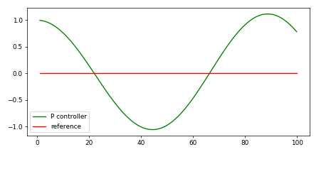
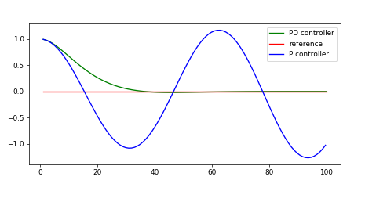

# CarND-Controls-PID
Self-Driving Car Engineer Nanodegree Program


---
# Introduction
## Goal:
This project implements a PID controller in C++ to maneuver the vehicle around the track in the [simulator](https://github.com/udacity/self-driving-car-sim.git)! Two PID controllers are to be implemented one for steering control and another for throttle control.

# Fundamentals
PID stands for Proportional-Integral-Derivative. It is a controller with three coeffients P, I and D. The effects of these coefficients are discussed below.

 ## Cross Track Error (CTE)
 * It is a distance between the vehicle´s actual trajectory and the groundtruth trajectory. It is best suited to control the vehicle by steering in proportion to CTE.
 
 ## Systematic Biss
* This is a term used in Robotics that tells you how much the vehicle´s steerable wheels are aligned.
 
## P- Controller 
* It sets the steering angle in proportion to CTE by virtue of a gain parameter called tau_p.
** `steering angle = -tau_p * cte`
* This controller steeers the vehicle towords the trajectory but when it reaches the trajectory it overshoots.
* The following graph demonstrates the overshooting due to P controller.

<p align="center">
  
</p>

## PD- Controller 
* In this controller the steering angle is not just proportional to CTE by virtue of tau_p but also the temporal derivative of the CTE with a gain parameter called tau_d.
** `steering angle = -tau_p * cte - tau_d * diff_cte`
* This helps the vehicle to not overshoot the trajectoy as the the derivative component counter steers the vehicle.
* The following graph demonstrates the behaviour of P controller and PD controller.

<p align="center">
  
</p>

## PID- Controller
* Finally this controller overcomes the problem of overshooting and systematic bias by adding one more term.
** `steering angle = -tau_p * cte - tau_d * diff_cte - tau_i * int_cte`
* This time, addition to PD controller parameters the steering angle is prportional to integral of all CTE over time. 
* The following graph summerizes the P-, PD-, and PID- controllers.

<p align="center">
  
</p>

## Basic Build Instructions

1. Clone this repo.
2. Make a build directory: `mkdir build && cd build`
3. Compile: `cmake .. && make`
4. Run it: `./pid`.

## Dependencies

* cmake >= 3.5
 * All OSes: [click here for installation instructions](https://cmake.org/install/)
* make >= 4.1(mac, linux), 3.81(Windows)
  * Linux: make is installed by default on most Linux distros
  * Mac: [install Xcode command line tools to get make](https://developer.apple.com/xcode/features/)
  * Windows: [Click here for installation instructions](http://gnuwin32.sourceforge.net/packages/make.htm)
* gcc/g++ >= 5.4
  * Linux: gcc / g++ is installed by default on most Linux distros
  * Mac: same deal as make - [install Xcode command line tools]((https://developer.apple.com/xcode/features/)
  * Windows: recommend using [MinGW](http://www.mingw.org/)
* [uWebSockets](https://github.com/uWebSockets/uWebSockets)
  * Run either `./install-mac.sh` or `./install-ubuntu.sh`.
  * If you install from source, checkout to commit `e94b6e1`, i.e.
    ```
    git clone https://github.com/uWebSockets/uWebSockets 
    cd uWebSockets
    git checkout e94b6e1
    ```
    Some function signatures have changed in v0.14.x. See [this PR](https://github.com/udacity/CarND-MPC-Project/pull/3) for more details.
* Simulator. You can download these from the [project intro page](https://github.com/udacity/self-driving-car-sim/releases) in the classroom.

Fellow students have put together a guide to Windows set-up for the project [here](https://s3-us-west-1.amazonaws.com/udacity-selfdrivingcar/files/Kidnapped_Vehicle_Windows_Setup.pdf) if the environment you have set up for the Sensor Fusion projects does not work for this project. There's also an experimental patch for windows in this [PR](https://github.com/udacity/CarND-PID-Control-Project/pull/3).

